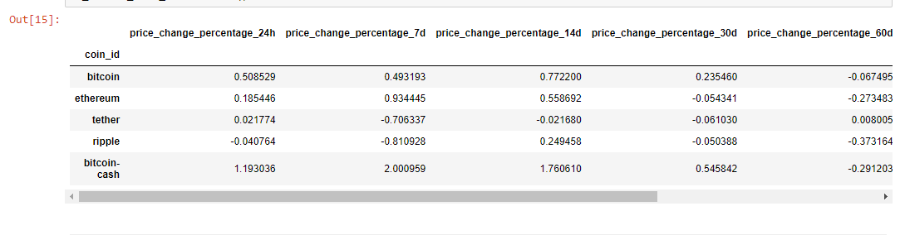
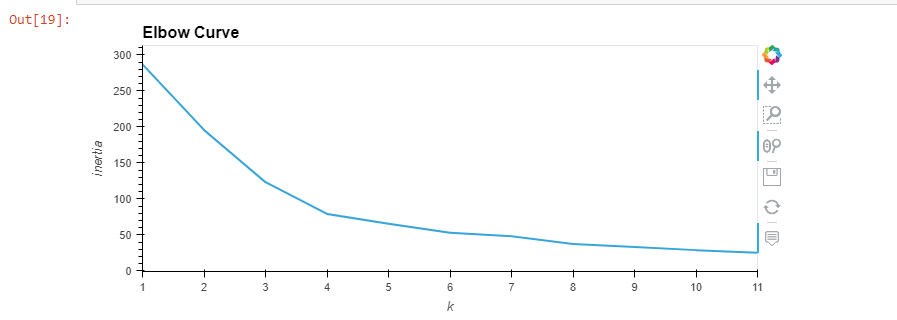
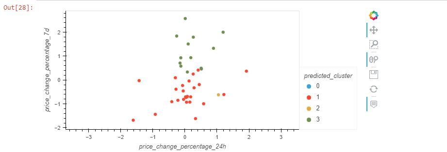
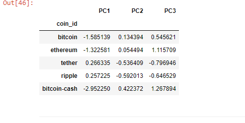
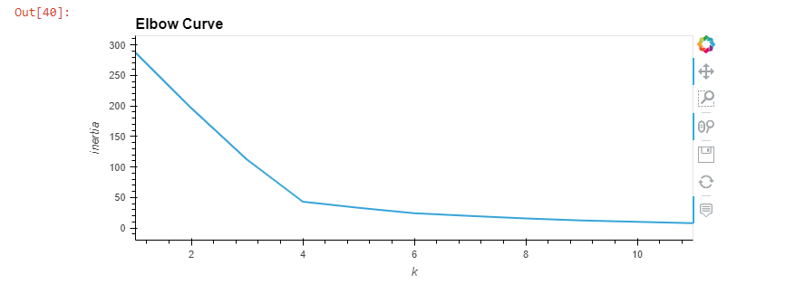
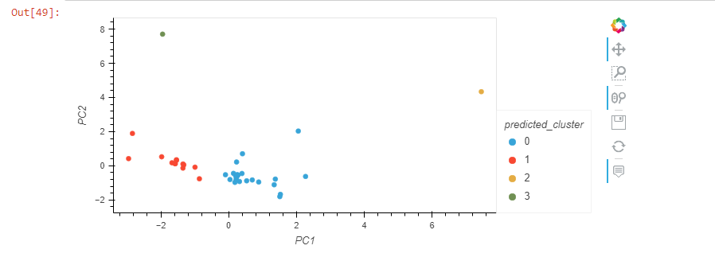
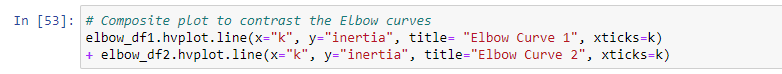
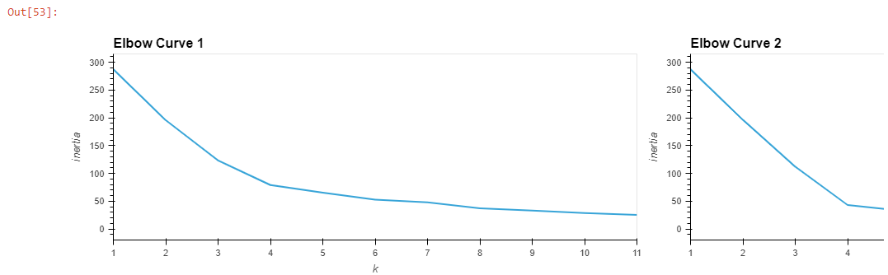
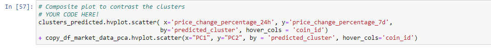
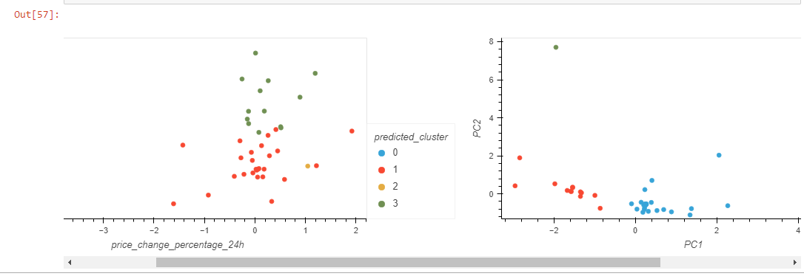

# CryptoClustering

## Instructions
1. Rename the Crypto_Clustering_starter_code.ipynb file as Crypto_Clustering.ipynb.
2. Load the crypto_market_data.csv into a DataFrame.
3. Get the summary statistics and plot the data to see what the data looks like before proceeding.

## Prepare the Data
1. Use the StandardScaler() module from scikit-learn to normalize the data from the CSV file.
2.Create a DataFrame with the scaled data and set the "coin_id" index from the original DataFrame as the index for the new DataFrame.
    1. The first five rows of the scaled DataFrame should appear as follows:
      

## Find the Best Value for k Using the Original Scaled DataFrame
Use the elbow method to find the best value for k using the following steps:
   1. Create a list with the number of k values from 1 to 11.
   2. Create an empty list to store the inertia values.
   3. Create a for loop to compute the inertia with each possible value of k.
   4. Create a dictionary with the data to plot the elbow curve.
   5. Plot a line chart with all the inertia values computed with the different values of k to visually identify the optimal value for k.
        
   6. Answer the following question in your notebook: What is the best value for k?
      ### Answer : The best value is k=4

## Cluster Cryptocurrencies with K-means Using the Original Scaled Data
Use the following steps to cluster the cryptocurrencies for the best value for k on the original scaled data:
   1. Initialize the K-means model with the best value for k.
   2. Fit the K-means model using the original scaled DataFrame.
   3. Predict the clusters to group the cryptocurrencies using the original scaled DataFrame.
   4. Create a copy of the original data and add a new column with the predicted clusters.
   5. Create a scatter plot using hvPlot as follows:
      1. Set the x-axis as "PC1" and the y-axis as "PC2".
      2. Color the graph points with the labels found using K-means.
      3. Add the "coin_id" column in the hover_cols parameter to identify the cryptocurrency represented by each data point.
        

## Optimize Clusters with Principal Component Analysis
1. Using the original scaled DataFrame, perform a PCA and reduce the features to three principal components.
2. Retrieve the explained variance to determine how much information can be attributed to each principal component and then answer the following question in your notebook:
   ### Q.1: What is the total explained variance of the three principal components?
   ### A.1: 0.37005408+0.32322221+0.19115222 = 0.8844285111826466
3. Create a new DataFrame with the PCA data and set the "coin_id" index from the original DataFrame as the index for the new DataFrame.
   1. The first five rows of the PCA DataFrame should appear as follows:
      

## Find the Best Value for k Using the PCA Data
Use the elbow method on the PCA data to find the best value for k using the following steps:
   1. Create a list with the number of k-values from 1 to 11.
   2. Create an empty list to store the inertia values.
   3. Create a for loop to compute the inertia with each possible value of k.
   4. Create a dictionary with the data to plot the Elbow curve.
   5. Plot a line chart with all the inertia values computed with the different values of k to visually identify the optimal value for k.
      
   6. Answer the following question in your notebook:
      ### Q.1: What is the best value for k when using the PCA data?
      ### A.1:  The best k-value is **k=4** when using PCA data
      ### Q.2: Does it differ from the best k value found using the original data?
      ### A.2: No, it is the same k value as found using the original data

## Cluster Cryptocurrencies with K-means Using the PCA Data
Use the following steps to cluster the cryptocurrencies for the best value for k on the PCA data:
  1. Initialize the K-means model with the best value for k.
  2. Fit the K-means model using the PCA data.
  3. Predict the clusters to group the cryptocurrencies using the PCA data.
  4. Create a copy of the DataFrame with the PCA data and add a new column to store the predicted clusters.
  5. Create a scatter plot using hvPlot as follows:
     1. Set the x-axis as "price_change_percentage_24h" and the y-axis as "price_change_percentage_7d".
     2. Color the graph points with the labels found using K-means.
     3. Add the "coin_id" column in the hover_cols parameter to identify the cryptocurrency represented by each data point.
        
        
  6. Answer the following question:
     ### Q.1 : What is the impact of using fewer features to cluster the data using K-Means?
     ### A.1: The impact of using PCA data resulted in tighter clusters, it also resulted in more entries within cluster 0 and cluster 1 than the original analysis did.

## Visualize and Compare the Results
To receive all points, you must:
1. Create a composite plot by using hvPlot and the plus sign (+) operator to compare the elbow curve that you created from the original data with the one that you created from the PCA data. 
     

      
2. Create a composite plot by using hvPlot and the plus (+) operator to compare the cryptocurrency clusters that resulted from using the original data with those that resulted from the PCA data.
   

   

